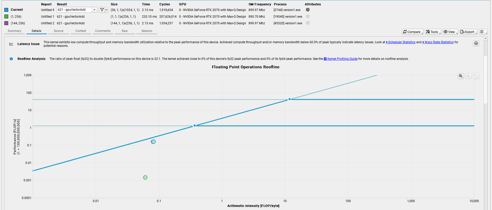

# An Even Easier Introduction to CUDA
- The related NVIDIA blog is [here](https://developer.nvidia.com/blog/even-easier-introduction-cuda/).
- A case with a vector addition was investigated to demonstrate an easy implementation of CUDA to port the compute-intensive part of the code on NVIDIA GPUs. 
- The vector size here is ~33.6M.
- An object-oriented approach has been implemented within the CUDA/C++ code.
- ***Managed*** vectors are created by modifying ***std::vector***s.
- A personal laptop with NVIDIA GeForce RTX 2070 with Max-Q Design is used for the simulations.
- ***Nsight-Compute*** is used for the performance analysis.
- The following ***launcSetup()*** class member function is developed for hardware specific kernel launches:
```
template<typename T>
void VectorAddGPU<T>::launchSetup()
{
    int devID;
    int numSMs;
    gpuGetDevice(&devID);

    cudaDeviceProp properties;
    cudaGetDeviceProperties(&properties, devID);
    int maxThreadsPerSM = properties.maxThreadsPerMultiProcessor;

    gpuDeviceGetAttribute(&numSMs, gpuDevAttrMultiProcessorCount, devID);
    auto blocksPerSM = maxThreadsPerSM / BLOCK_SIZE;
    std::cout << "There are " << numSMs << " SMs in this device." << std::endl;
    std::cout << "Max number of threads per SM: " << maxThreadsPerSM << endl;
    std::cout << "Block Size: " << BLOCK_SIZE << std::endl;
    std::cout << "Blocks per SM (maxThreadsPerSM / BLOCK_SIZE): " << blocksPerSM << std::endl;

    gridSize = blocksPerSM * numSMs;
    std::cout << "Grid Size (BlocksPerSM * numSMs) : " << gridSize << std::endl;
}
```

## Runtimes:
- The table below was prepared using the run times in *ms* along with the memory bandwidth and achieved occupancy.

| Solver | Kernel Runtime (ms) | Bandwidth (GB/s) | Achieved Occupancy (% max) |
| :---: | ---: | ---: | ---: |
| CPU* | 53.95 | N/A | N/A
| CUDA (1, 1) | 16,644 | N/A | N/A
| CUDA (1, 256) | 233.10 | 2.35 | 25.00
| CUDA (144, 256)* | 2.15 | 191.26 | 98.54
| CUDA (288, 256) | 2.12 | 190.02 | 98.85
| CUDA (576, 256) | 2.10 | 191.86 | 98.57
| CUDA (1152, 256) | 2.10 | 192.66 | 98.35
| CUDA (2304, 256) | 2.09 | 192.35 | 98.16
| CUDA (4608, 256) | 2.06 | 195.45 | 98.00
| CUDA (36, 1024)* | 2.13 | 189.47 | 99.56
| CUDA (72, 1024)* | 2.11 | 190.79 | 99.05
| CUDA (1152, 1024)* | 2.14 | 192.36 | 97.95

* ****CPU*** is a CPU solver using OpenMP threads
* \* ***144 * 256*** (or ***36 * 1024***) is the maximum thread capacity of the current GPU extracted by the kernel function ***launchSetup()***
- Another GPU solver with ***prefetching*** data to the GPUs by ***cudaMemPrefetchAsync()*** has been prepared but could never been tried, since Windows does not support it.

## Roofline analysis:



- Here, the legend "current" is for the case with 36 thread blocks each has 1024 threads.
- Our kernel is ***memory-bound***.
## Future work
- Try ***prefetch.cu*** on a Linux machine
- Try an AMD machine