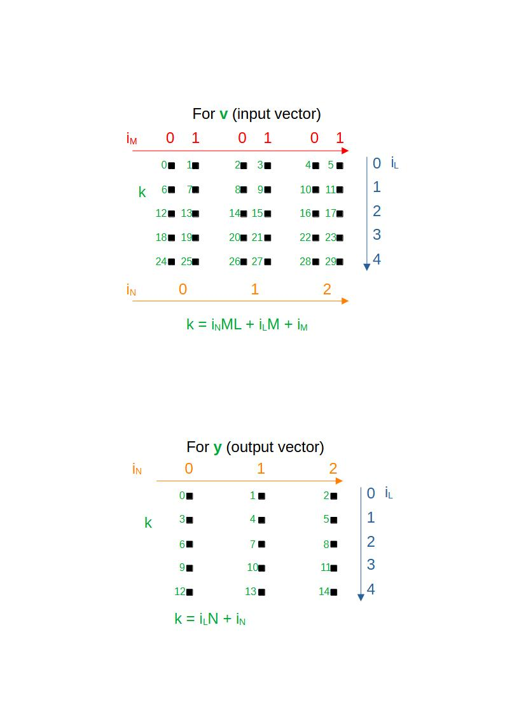

# Analysis-Driven Optimization
- The original NVIDIA developer blog post by [Robert Crovella](https://developer.nvidia.com/blog/author/bob-crovella/) has three parts and the first part can be accessed [here](https://developer.nvidia.com/blog/analysis-driven-optimization-preparing-for-analysis-with-nvidia-nsight-compute-part-1/).
- I am sharing my experience with code development and optimization here.
## Code for analysis
- The code does the following two jobs ***N*** times:
  - Averaging a set of ***M*** vectors each has a size of ***L***
  - Multiplying the average vector by a matrix, which has a size of ***L $\times$ L***.
- I named the initial vector, the matrix, and the output vector as ***v***, ***A***, and ***y***, respectively.
- ***v*** has randomly placed **1**s and **2**s inside. It has been constituted by ***N*** different random vectors. Hence it is an ***L*** by ***N*** matrix.
- A single matrix, ***A***, is used in the entire problem for the matrix - vector multiplication. It's also randomly made by **1**s and **2**s.
- The output is a team of ***N*** vectors with a size of ***L***.
- I developed object-oriented codes for the problem, using ***strategy*** and ***factory method*** design patterns to develop and try many different solvers.
- Only ***SolverFactory.h*** and ***Parameters.h*** is changed to play with the parameters and the new solvers.

## CPU Solvers
- There are two CPU solvers under codes/solvers/, which are ***CpuOriginal***, the original code from [NVIDIA's nsight-training repo](https://github.com/NVIDIA/nsight-training/tree/master/cuda/2020_ncu_smem), and ***CpuSolver***, which I've initially developed.
- Two solvers can be used in each run: a ***reference solver*** and a ***test solver***.
- Initially, ***CpuOriginal*** is used as the reference solver. As new solvers are developed, any tested faster solver can be used as the reference solver.
- The first problem that I encountered was the indexing. I used a different indexing, and then the results seemed different with the author's although they are actually just the transpose of each other.
- Hence, I set up the following indexing to match my results with the original post:



where:
  - $i_N$: index through the number of repetitions
  - $i_M$: index through the number of vectors in a vector set
  - $i_L$: index through the vector size

- The following is the solver function of the ***CpuSolver*** class:
```
template <typename T>
void CpuSolver<T>::solver()
{
    int nThreads = omp_get_max_threads();
    omp_set_num_threads(nThreads);
    cout << "Working with " << nThreads << " OpenMP threads." << endl;
    #pragma omp parallel
    {
        #pragma omp for schedule(static) 
        for (auto iN = 0; iN < N; ++iN)
        {
            vector<T> vAvg;

            // Vector average
            for (auto iL = 0; iL < L; ++iL)
            {
                T temp = 0.0;
                for (auto iM = 0; iM < M; ++iM)
                {
                    temp += this->v[iN * M * L + iL * M + iM];
                }
                vAvg.push_back(temp / static_cast<T>(M));
            }

            // Matrix - Vector multiplication
            for (auto iL = 0; iL < L; ++iL)
            {
                T temp = 0.0;
                for (auto jL = 0; jL < L; ++jL)
                {
                    temp += this->A[iL * L + jL] * vAvg[jL];
                }
                this->y[iL * N + iN] = temp;
            }
        }
    }
}
```
- The following is a sample output comparing two CPU solvers:
```
Nvidia Blog: Analysis-Driven Optimization (ADO)
Vector Size               : 1024
Number of vectors         : 1024
Number of vector sets     : 1024


Solver: cpuOriginal
Working with 12 OpenMP threads.

Solver: cpu
Working with 12 OpenMP threads.

Verifying the test code
Maximum Error: 0

Runtimes:
cpuOriginal         : 4093.473 ms.
cpu                 : 2209.617 ms.
Speedup             : 1.853
```
- An extra inner for loop in the original CPU solver causes the extra runtime.
## GPU Solvers