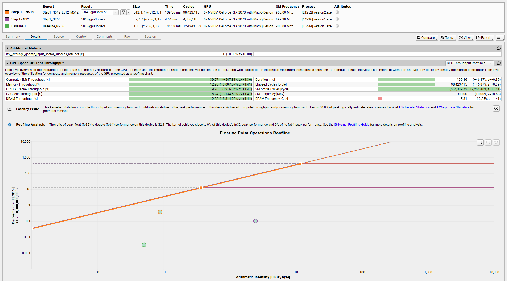
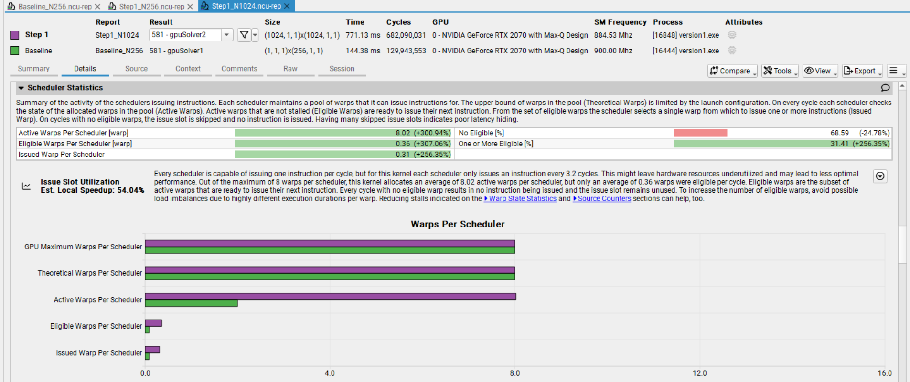
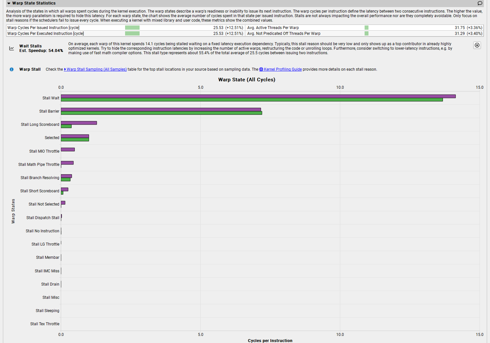
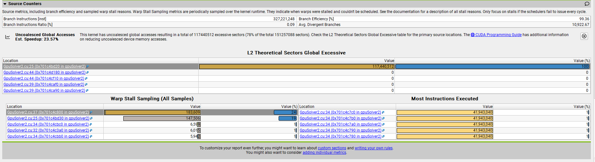
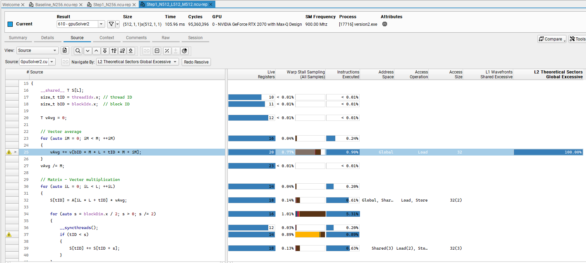

# Analysis-Driven Optimization
- The original NVIDIA developer blog post by [Robert Crovella](https://developer.nvidia.com/blog/author/bob-crovella/) has three parts and the first part can be accessed [here](https://developer.nvidia.com/blog/analysis-driven-optimization-preparing-for-analysis-with-nvidia-nsight-compute-part-1/).
- I am sharing my experience with code development and optimization here.
- A personal laptop, ***Hagi***, with ***NVIDIA GeForce RTX 2070 with Max-Q Design*** and ***INTEL CORE i7 10th GEN*** is used for the simulations (with Windows & Microsoft Visual Studio).
## Code for analysis
- The code does the following two jobs ***N*** times:
  - Averaging a set of ***M*** vectors each has a size of ***L***
  - Multiplying the average vector by a matrix, which has a size of ***L $\times$ L***.
- I named the initial vector, the matrix, and the output vector as ***v***, ***A***, and ***y***, respectively.
- ***v*** has randomly placed **1**s and **2**s inside. It has been constituted by ***N*** different random vectors. Hence it is an ***L*** by ***N*** matrix.
- A single matrix, ***A***, is used in the entire problem for the matrix - vector multiplication. It's also randomly made by **1**s and **2**s.
- The output is a team of ***N*** vectors with a size of ***L***.
- I developed object-oriented codes for the problem, using ***strategy*** and ***factory method*** design patterns to develop and try many different solvers.
- Only ***SolverFactory.h*** and ***Parameters.h*** is changed to play with the parameters and the new solvers.

## CPU Solvers
- There are two CPU solvers under codes/solvers/, which are ***CpuOriginal***, the original code from [NVIDIA's nsight-training repo](https://github.com/NVIDIA/nsight-training/tree/master/cuda/2020_ncu_smem), and ***CpuSolver***, which I've initially developed.
- Two solvers can be used in each run: a ***reference solver*** and a ***test solver***, which can be set up in ***Parameters.h***.
- Initially, ***CpuOriginal*** is used as the reference solver. As new solvers are developed, any tested faster solver can be used as the reference solver.
- The first problem that I encountered was the indexing. I used a different indexing, and then the results seemed different with the author's although they are actually just the transpose of each other. In other words, the vector sets were presented differently. 
- Hence, I set up the following indexing to match my results with the original post:


where:
  - $i_N$: index through the number of repetitions
  - $i_M$: index through the number of vectors in a vector set
  - $i_L$: index through the vector size

- I used $N = M = L = 512$, since using the original size of the problem crashes my laptop when I use nsight-compute.
- The following is the solver function of the ***CpuSolver*** class:
```
template <typename T>
void CpuSolver<T>::solver()
{
    int nThreads = omp_get_max_threads();
    omp_set_num_threads(nThreads);
    cout << "Working with " << nThreads << " OpenMP threads." << endl;
    #pragma omp parallel
    {
        #pragma omp for schedule(static) 
        for (auto iN = 0; iN < N; ++iN)
        {
            vector<T> vAvg;

            // Vector average
            for (auto iL = 0; iL < L; ++iL)
            {
                T temp = 0.0;
                for (auto iM = 0; iM < M; ++iM)
                {
                    temp += this->v[iN * M * L + iL * M + iM];
                }
                vAvg.push_back(temp / static_cast<T>(M));
            }

            // Matrix - Vector multiplication
            for (auto iL = 0; iL < L; ++iL)
            {
                T temp = 0.0;
                for (auto jL = 0; jL < L; ++jL)
                {
                    temp += this->A[iL * L + jL] * vAvg[jL];
                }
                this->y[iL * N + iN] = temp;
            }
        }
    }
}
```
- The following is a sample output comparing two CPU solvers:
```
Nvidia Blog: Analysis-Driven Optimization (ADO)
Vector Size               : 512
Number of vectors         : 512
Number of vector sets     : 512


Solver: cpuOriginal
Working with 12 OpenMP threads.

Solver: cpu
Working with 12 OpenMP thread(s).

Verifying the test code
Maximum Error: 0

Runtimes:
cpuOriginal         : 394.944 ms.
cpu                 : 225.696 ms.
Speedup             : 1.750
```
- An extra inner for loop inside the vector average loop in the original CPU solver causes the extra runtime.
- I've continued with ***CpuSolver1*** as the CPU solver at the rest of this work.
## GPU Solvers
- The following kernel, similar to (if not the same as) the one in [the original post](https://developer.nvidia.com/blog/analysis-driven-optimization-preparing-for-analysis-with-nvidia-nsight-compute-part-1/) (Part 1) is developed for the analysis:
```
template <typename T>
__global__
void gpuSolver1(T* __restrict__ v, T* __restrict__ A, T* __restrict__ y)
{
    size_t idx = threadIdx.x;
    __shared__ T S[L];

    for (auto iN = 0; iN < N; ++iN)
    {
        T vAvg = 0;

        // Vector average
        for (auto iM = 0; iM < M; ++iM)
        {
            vAvg += v[iN * M * L + idx * M + iM];
        }
        vAvg /= M;
        
        // Matrix - Vector multiplication
        for (auto iL = 0; iL < L; ++iL)
        {
            S[idx] = A[iL * L + idx] * vAvg;

            for (auto s = blockDim.x / 2; s > 0; s /= 2)
            {
                __syncthreads();
                if (idx < s)
                {
                    S[idx] += S[idx + s];
                }
            }
            if (idx == 0)
            {
                y[iL * N + iN] = S[0];
            }
        }
    }
}
``` 
- In addition to the changes in indexes (e.g. $i_M$ instead of **i**, $i_N$ instead of **k**, etc.), I eliminated the first ***____syncthreads()*** right under the first *for loop* in matrix-vector multiplication.
- The GPU solver, which uses this kernel is named ***GpuSolver1***.
- The solver launches the kernel with the following launch configuration:
```
gpuSolver1<<<1, L>>>(dV, dA, dY);
```
- where the following are the device vectors:
  - dV: Input vector system
  - dA: Matrix
  - dY: Output vector system

- A compiler flag, ***-DKERNELTIME***, should be used to utilise a CPU timer to measure only the kernel runtime.
- The reported runtimes at the end of the output includes the time passed during data transfer between CPU and GPU, and kernel runtime.
- The following is the performance results of ***GpuSolver1*** against the ***CpuSolver*** with **1** and **12** ***OpenMP threads***, respectively:
```
Nvidia Blog: Analysis-Driven Optimization (ADO)
Vector Size               : 512
Number of vectors         : 512
Number of vector sets     : 512


Solver: cpu
Working with 1 OpenMP thread(s).

Solver: gpuSolver1
Verifying warmup launch
Warmup for test solver: gpuSolver1
Kernel runtime: 2717.72 ms.

Verifying the test code
Maximum Error: 0

Runtimes:
cpu                 : 1338.210 ms.
gpuSolver1          : 2853.665 ms.
Speedup             : 0.469
``` 
```
Nvidia Blog: Analysis-Driven Optimization (ADO)
Vector Size               : 512
Number of vectors         : 512
Number of vector sets     : 512


Solver: cpu
Working with 12 OpenMP thread(s).

Solver: gpuSolver1
Verifying warmup launch
Warmup for test solver: gpuSolver1
Kernel runtime: 2714.74 ms.

Verifying the test code
Maximum Error: 0

Runtimes:
cpu                 : 216.025 ms.
gpuSolver1          : 2841.109 ms.
Speedup             : 0.076
```
- In my laptop, ***Hagi***, the ***CpuSolver*** with a single thread runs about 2 times faster than ***GpuSolver1***.
- When I use all available CPU cores, ***CpuSolver*** runs about 12.6 times faster than ***GpuSolver1*** kernel.
- Here is the results summary:

| Solver | Kernel runtime (ms) | Total runtime (ms) |
| --- | ---: | ---: |
| Cpu (1 thread) | 1338.2 | |
| Cpu (12 threads) | 216.0 | |
| GpuSolver1 | 2714.7 | 2841.1 |

### Profiling ***GpuSolver1***
- NVIDIA Nsight Compute 2024.2.1.0 was used to profile the kernels.
- The following problem parameters were used initially:
  - **N = 512**
  - **M = 512**
  - **L = 512**
- Profiling ***gpuSolver1_kernel*** with a single thread block, using these parameters, crashed my system, and system restarted. Hence I set the parameters as follows (after crashing ***Hagi*** a few more times):
  - **N = 32**
  - **M = 32**
  - **L = 256**
- Here is the initial profiler result starting with the **GPU Speed of Light**:


- Bottleneck rule is used here to guide our analysis.
- I got the small grid warning as expected.
- Arithmetic Intensity (AI) is 0.05.
- My kernel is far from both rooflines. Hence, I am not efficiently utilizing the compute and memory resources of the GPU.
- Launch Statistics is as follows:


### A new GPU solver, ***GpuSolver2***
- Considering the ***bottleneck***, stated by Nsight Compute, ***GpuSolver1*** should be refactored to develop the new solver, ***GpuSolver2***, to utilise a larger grid.
- In ***GpuSolver2***, **N** data sets are distributed across **N** blocks.
- Here is the new kernel and the new launch configuration, respectively:

```
template <typename T>
__global__
void gpuSolver2(T* __restrict__ v, T* __restrict__ A, T* __restrict__ y)
{
    __shared__ T S[L];
    size_t tID = threadIdx.x; // thread ID
    size_t bID = blockIdx.x;  // block ID

    T vAvg = 0;

    // Vector average
    for (auto iM = 0; iM < M; ++iM)
    {
        vAvg += v[bID * M * L + tID * M + iM];
    }
    vAvg /= M;

    // Matrix - Vector multiplication
    for (auto iL = 0; iL < L; ++iL)
    {
        S[tID] = A[iL * L + tID] * vAvg;

        for (auto s = blockDim.x / 2; s > 0; s /= 2)
        {
            __syncthreads();
            if (tID < s)
            {
                S[tID] += S[tID + s];
            }
        }
        if (tID == 0)
        {
            y[iL * N + bID] = S[0];
        }
    }
}
```
```
gpuSolver2<<<N, L>>>(dV, dA, dY);
```
- Here is a performance result with ***CpuSolver*** and ***GpuSolver2*** with **N = M = L = 512**:
```
Nvidia Blog: Analysis-Driven Optimization (ADO)
Vector Size               : 512
Number of vectors         : 512
Number of vector sets     : 512


Solver: cpu
Working with 12 OpenMP thread(s).

Solver: gpuSolver2
Verifying warmup launch
Warmup for test solver: gpuSolver2
Kernel runtime: 58.703 ms.

Verifying the test code
Maximum Error: 0

Runtimes:
cpu                 : 217.916 ms.
gpuSolver2          : 188.397 ms.
Speedup             : 1.157
```
- Here is the updated performance summary:

| Solver | Kernel runtime (ms) | Total runtime (ms) |
| --- | ---: | ---: |
| Cpu (1 thread) | 1338.2 | |
| Cpu (12 threads) | 216.0 | |
| GpuSolver1 | 2714.7 | 2841.1 |
| GpuSolver2 | 58.7 | 188.397 |

- ***GpuSolver2*** runs 3.7 times faster than CPU solver with multi-threads.
- The detailed kernel performance by nsight-compute is as follows:



- Three cases were profiled here. 
  - **Case 1:** ***GpuSolver1*** with **N = 32**, **M = 32**, and **L = 256**, and with the launch configuration <<<1, 256>>>.
  - **Case 2:** ***GpuSolver2*** with **N = 32**, **M = 32**, and **L = 256**, and with the launch configuration <<<32, 256>>>.
  - **Case 3:** ***GpuSolver2*** with **N = 512**, **M = 512**, and **L = 512**, and with the launch configuration <<<512, 512>>>.

- Runtimes of **Cases 1** and **2** can be compared here, since the problem size is the same for these two, although we already compared them for a *larger problem size* using a CPU timer as tabulated above.

- Here, a 31.8 times faster solver was achieved by refactoring our previous solver, considering nsight-compute's ***small grid*** warning. Since, the problem size is still small, we still see the same warning for **Case 2**.

- **Case 3** is the one with the larger problem size, and comparing the runtime is not meaningful as in the case in the original blog post.
- The following ***Latency Issue*** warning is received this time:
  - *This kernel exhibits low compute throughput and memory bandwidth utilization relative to the peak performance of this device. Achieved compute throughput and/or memory bandwidth below 60.0% of peak typically indicate latency issues. Look at Scheduler Statistics and Warp State Statistics for potential reasons.*
- Since, the profiler directed me to ***Scheduler Statistics***, first, I read the instructions there and summarized them below, and then read the *rule* named ***Issue Slot Utilization***. 



- **Summary:**
  - A ***Scheduler*** issues instructions via warps.
  - Each scheduler is responsible to issue instructions for a pool of warps.
  - The upper limit of the number of warps in a pool is called ***theoretical warps***, and it's set up by kernel launch configuration.
  - The allocated warps in a pool is called ***active warps***.
  - Each ***scheduler*** checks the state of ***active warps*** on each cycle.
  - ***Eligible warps*** are the active warps, which are not stalled and ready to issue their instructions.
  - The ***scheduler*** selects one of the ***eligible warps***, and issues instructions. The selected ***eligible warp*** is called the ***issued warp***.
  - If there is **NO** ***eligible warp*** on a cycle, the issue slot is skipped, hence no instruction is issued.
  - If your kernel has many skipped issues, it means that your kernel has ***poor latency hiding***.
- ***Issue Slot Utilization***: *Every scheduler is capable of issuing one instruction per cycle, but for this kernel each scheduler only issues an instruction every 3.2 cycles. This might leave hardware resources underutilized and may lead to less optimal performance. Out of the maximum of 8 warps per scheduler, this kernel allocates an average of 8.02 active warps per scheduler, but only an average of 0.36 warps were eligible per cycle. Eligible warps are the subset of active warps that are ready to issue their next instruction. Every cycle with no eligible warp results in no instruction being issued and the issue slot remains unused. To increase the number of eligible warps, avoid possible load imbalances due to highly different execution durations per warp. Reducing stalls indicated on the Warp State Statistics and Source Counters sections can help, too.*
- **Diagnosis:**
  - Each scheduler is capable of issuing 1 warp per cycle, but the achieved number is 1 instruction in 3.2 cycles.
  - We have 8 warps per scheduler, but only ***0.36*** warps are ***eligible*** per cycle.
- **Cure:**
  - Avoid possible load imbalances due to highly different execution durations per warp.
  - An ***estimated speedup*** after fixing this is **54.04%**.
- Let's check also the ***warp state statistics***:



- **Summary**
  - ***Warp state***: a warp's readiness (or inability) to issue its next instruction.
  - ***Warp cycles per instruction***: Latency between 2 consecutive instructions.
  - Higher ***warp cycles per instruction*** means more warp parallelism is required to hide this latency.
  - ***The number in the chart for each state*** is the average number of cycles spent in that state per issued instruction.
  - We should focus on a stall when the schedulers fail to issue every cycle.
- **Diagnosis:**
  - My results are different than those of the original blog post.
  - ***Stall Wait*** has the highest number of warp cycles per instruction.
  - Each warp here in this kernel spends 14.1 cycles being stalled waiting on a fixed latency execution dependency. 
- **Cure:**
  - Hide these latencies by:
    - Increase the number of active warps
    - Restructure the code
    - Unroll loops
  
    or
    - Consider switching to lower-latency instructions
  - **An additional note:**
    - Total number of cycles between issuing 2 instructions is **25.5** and **55.4%** of this is ***Wait Stall***. 
- In the ***Source Counters*** tab, another rule is given called ***Uncoalesced Global Accesses***. 
- ***Uncoalesced Global Accesses***: *This kernel has uncoalesced global accesses resulting in a total of 117440512 excessive sectors (78% of the total 151257088 sectors). Check the L2 Theoretical Sectors Global Excessive table for the primary source locations. The CUDA Programming Guide has additional information on reducing uncoalesced device memory accesses.*
- When I check the ***L2 Theoretical Sectors Global Excessive*** table, I get the following:



- All of the ***uncoalesced global access*** is encountered in line 25 of the solver. When I click on that line, I get the following:



- ***Vector average*** part of the code is where all the uncoalesced global access occurs. 
- The next GPU solver version will address this issue.

### The next GPU solver, ***GpuSolver3***
- Warp shuffle is implemented to perform vector average.