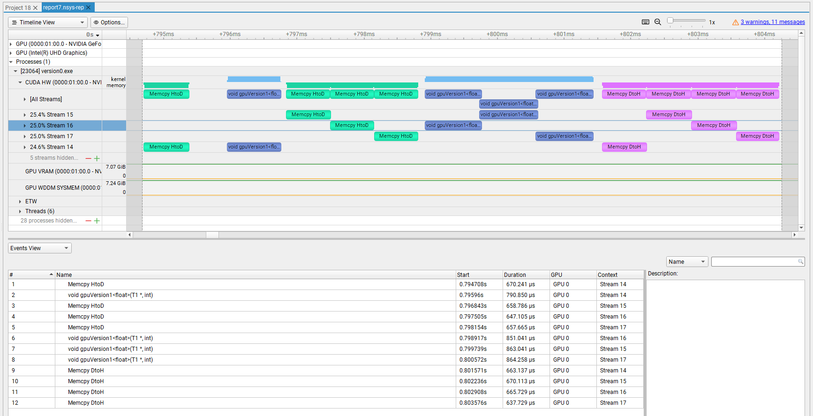

# How to Overlap Data Transfers in CUDA/C++
## Accomplished
- The original NVIDIA blog is [here](https://developer.nvidia.com/blog/how-overlap-data-transfers-cuda-cc/).
- Codes are developed in object oriented fashion.
- A personal laptop, ***Hagi***, with NVIDIA GeForce RTX 2070 with Max-Q Design is used for the simulations (with Windows & Microsoft Visual Studio solution).
- The following flag was used while compiling:
```
--default-stream per-thread
```
- Nsight-systems is used for profiling.
- No overlap could be achieved.
- The results for runtime are tabulated below:

| Solver | Total Runtime (ms) | 
| --- | ---: | 
| CPU* | 16.790 | 
| GPU Sequential | 9.655 |
| GPU Version 1 | 9.384 | 
| GPU Version 2 | 9.246 | 

* ****CPU*** is a CPU solver using OpenMP threads

- Here's a sample output for GPU sover version 1:



## To do
- Try to resolve the problem with the result for the current hardware.
- Build CUDA Samples and run deviceQuery.
- Try another system (Setonix and one more NVIDIA card)