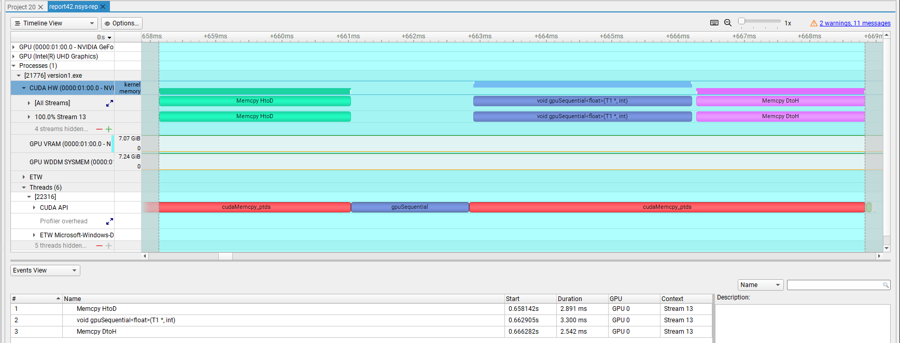
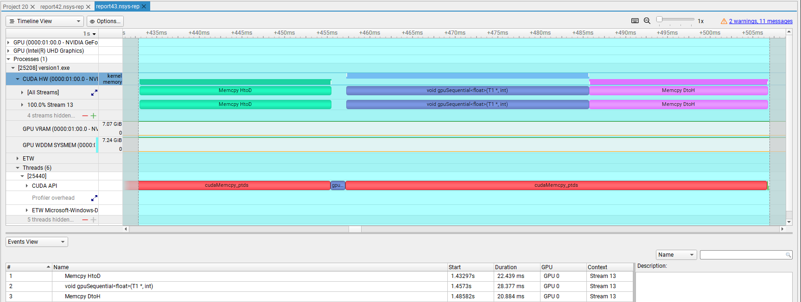
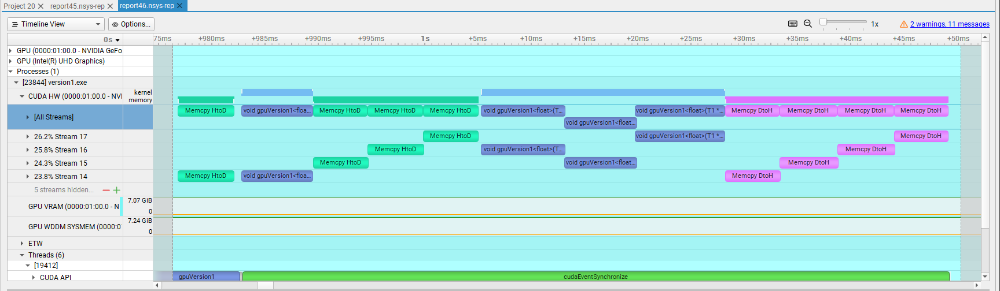
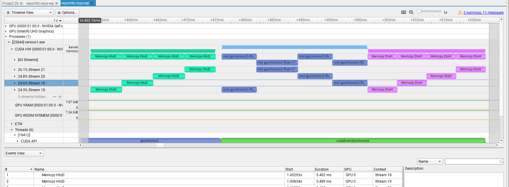
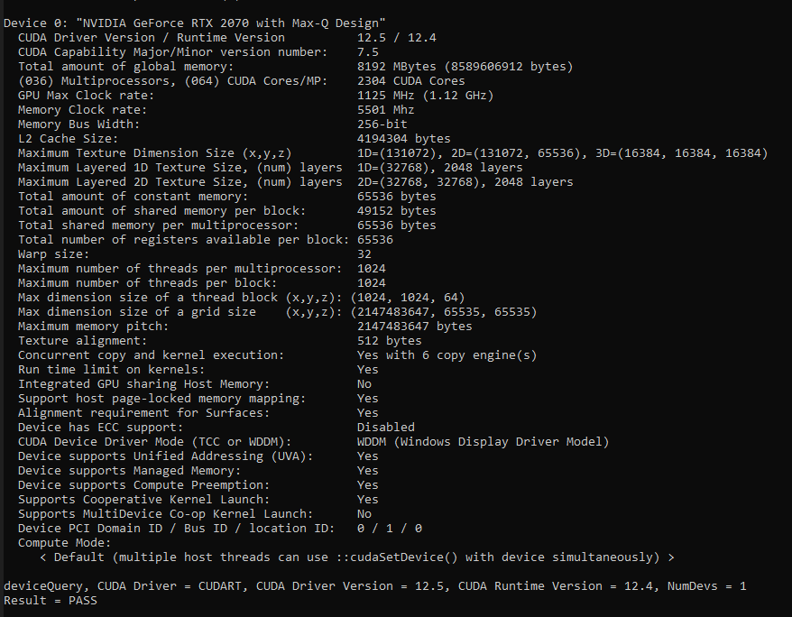
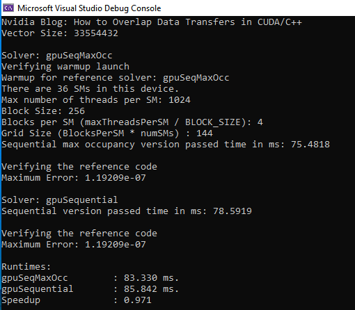
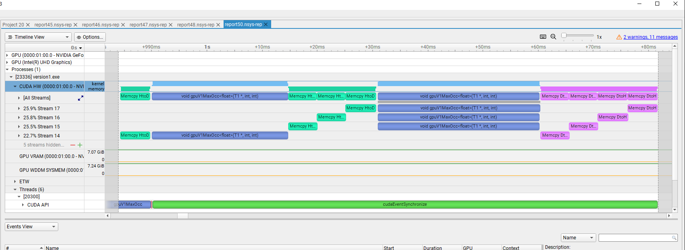
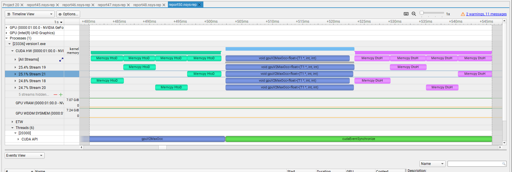
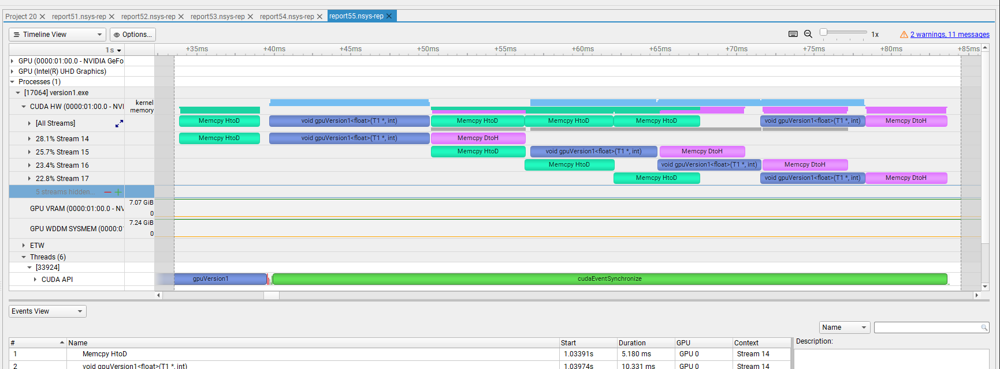

# How to Overlap Data Transfers in CUDA/C++
## Problem
- The original NVIDIA blog by [Mark Harris](https://developer.nvidia.com/blog/author/mharris/) is [here](https://developer.nvidia.com/blog/how-overlap-data-transfers-cuda-cc/).
- A personal laptop, ***Hagi***, with NVIDIA GeForce RTX 2070 with Max-Q Design is used for the simulations (with Windows & Microsoft Visual Studio solution).
- Codes are developed in object oriented fashion.
- Pinned vectors are created by modifying ***std::vector***s.
- The problem size was set to ~4M (1 << 22) in the beginning.
- 4 CUDA streams are used
- The following flag is used while compiling:
```
--default-stream per-thread
```
- Nsight-systems is used for profiling.
- The following timeline was obtained for the sequential GPU solver.



- Function call for ***gpuSequential*** takes **1.775 ms**, which is comparable to the function execution itself. A bigger problem size is selected to make the runtime for the function calls negligible and focus on the function and data transfer overlaps.
- Problem size is set to **~33.6M (1 << 25)**.
- Timeline for the sequential solver is below:



- The results for runtime are tabulated below:

| Solver | Total Runtime (ms) | 
| --- | ---: | 
| CPU* | 218.375 | 
| GPU Sequential | 70.615 |
| GPU Version 1 | 70.344 | 
| GPU Version 2 | 70.252 | 

* ****CPU*** is a CPU solver using OpenMP threads
- No overlap could be achieved in the first try.
- Here are the timelines for GPU solver versions 1 and 2, respectively:





## Solution & Optimisation
### 1. Lack of kernel overlap
- The reason that the kernels don't overlap is the fact that each stream already saturates the GPU in terms of computation. Problem size is big, and our streams already use enough threads and then the kernels don't overlap. 
- In addition, since a kernel execution by a single stream already saturates the GPU computation, using multistreams wouldn't give us a speedup even if they overlap. 
- Let's check this and try to see a kernel overlap. 
- As the first job, let's check the properties of the device that we are using by building and running ***deviceQuery*** on **Hagi**. Here is the results:



- The items we need to focus for now are the followings:
```
1. Concurrent copy and kernel execution         : Yes with 6 copy engines
2. Maximum number of threads per multiprocessor : 1024
```

- From Item 1, we can conclude that the problem is not the hardware, since concurrency is supported, and there are 6 copy engines available.
- Let's start to modify our GPU solvers using [flexible kernels with grid-stride loops](https://developer.nvidia.com/blog/cuda-pro-tip-write-flexible-kernels-grid-stride-loops/) in the light of Item 2.
- 256 threads are used in a block.
- A new sequential GPU solver is developed with an optimal launch configuration for maximum thread occupancy in an SM.
- To determine the number of blocks in a grid, a kernel launch class member function is developed as below:
```
template<typename T>
void GpuSeqMaxOcc<T>::launchSetup()
{
  int devID;
  int numSMs;
  cudaGetDevice(&devID);

  cudaDeviceProp properties;
  cudaGetDeviceProperties(&properties, devID);
  int maxThreadsPerSM = properties.maxThreadsPerMultiProcessor;

  cudaDeviceGetAttribute(&numSMs, cudaDevAttrMultiProcessorCount, devID);
  auto blocksPerSM = maxThreadsPerSM / BLOCK_SIZE;
  std::cout << "There are " << numSMs << " SMs in this device." << std::endl;
  std::cout << "Max number of threads per SM: " << maxThreadsPerSM << endl;
  std::cout << "Block Size: " << BLOCK_SIZE << std::endl;
  std::cout << "Blocks per SM (maxThreadsPerSM / BLOCK_SIZE): " << blocksPerSM << std::endl;

  gridSize = blocksPerSM * numSMs;
  std::cout << "Grid Size (BlocksPerSM * numSMs) : " << gridSize << std::endl;
}
```

- Here is a sample output with sequential and the new sequential GPU solvers:



- The difference between the runtimes of the newly created and previous sequential GPU solvers is negligible.
- After using this new configuration to our multi-stream versions, we get the following timelines for the Version 1 and Version 2, respectively:





- Total runtimes are 97.763 ms and 65.572 ms for versions 1 and 2, respectively.
- Stream 14 in Version 1 behaves like a default stream, which causes a stall.
- In Version 2, we can observe a perfect kernel overlap by all 4 streams. 
- A kernel overlap wouldn't give us any significant speedup for the reasons mentioned above. Let's try our chance in data transfer overlaps, keeping the problem with Version 1 as a secret for us now.

### 2. Lack of data transfer overlap
- The lack of overlapping in data transfer is another problem.
- As we see in Item 1 of the output of ***deviceQuery***, there are 6 copy engines. 
- The problem is not the hardware, then.
- The cause of the problem is the driver mode: WDDM (Windows Display Driver Model).
- Please, read Robert Crovella's [respond about this issue](https://stackoverflow.com/questions/19944429/cuda-performance-penalty-when-running-in-windows#:~:text=The%20best%20solution%20under%20windows%20is%20to%20switch,Quadro%20family%20of%20GPUs%20--%20i.e.%20not%20GeForce.).

- In Tesla GPUs and some of the Quadro GPUs, the operating mode can be changed to TCC from WDDM using the following:
```
nvidia-smi -i 0 -dm TCC
```
- In GeForce GPUs, the WDDM command queue should be flushed manually, and one of the best solutions is using ***cudaStreamQuery(stream)***:
```
for (int i = 0; i < N_STREAMS; ++i)
{
    int offset = i * STREAM_SIZE;
    copyH2D(offset, stream[i]);
    gpuVersion1 << < GRID_SIZE/N_STREAMS, BLOCK_SIZE, 0, stream[i] >> > (dA, offset);
    copyD2H(offset, stream[i]);
    cudaStreamQuery(stream[i]);
}
```
- Now, we have the following for Version 1 without maximum thread occupancy modification:



- Runtime has reduced to **45.302 ms**, which is **4.82** and **1.55** times faster than the CPU version and the fastest former GPU version, respectively.
- There is still no overlap while the first stream transfers data from host to device and eexecutes the kernel. The first overlap is observed when the first kernel transfers data from device to host.
- No data transfer overlap is achieved in Version 2. 
- Final runtimes are tabulated as follows:

| Solver | Total Runtime (ms) | 
| --- | ---: | 
| CPU* | 218.375 | 
| GPU Sequential | 70.615 |
| GPU Version 1 | 45.302 | 
| GPU Version 2 | 70.252 | 

## Future Work
- Find a Linux machine and try the codes
- Use Setonix to figure out the things in AMD side.
- Can anything be done about the lack of overlap before the data transfer of the first stream from device to host?