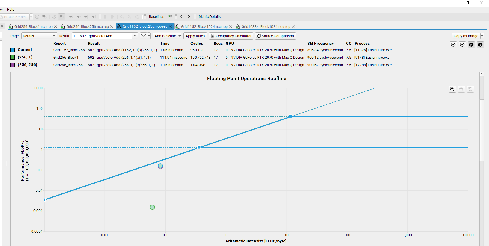

# An Even Easier Introduction to CUDA
- The related NVIDIA blog is [here](https://developer.nvidia.com/blog/even-easier-introduction-cuda/).
- A case with a vector addition was investigated to demonstrate an easy implementation of CUDA to port the compute-intensive part of the code on NVIDIA GPUs. 
- The vector size here is ~17M.
- An object-oriented approach has been implemented within the CUDA/C++ code.
- A personal laptop with NVIDIA GeForce RTX 2070 with Max-Q Design is used for the simulations.
- ***Nsight-Compute*** has been used for the performance analysis.

## Runtimes:
- The performance results are as follows:

| Solver | Kernel Runtime (ms) | Bandwidth (GB/s) |
| --- | --- | --- |
| CPU* | 164.75 | N/A 
| CUDA (1, 1) | 8341.16 | N/A
| CUDA (256, 1) | 111.94 | 2.42
| CUDA (256, 256) | 1.16 | 171.64
| CUDA (1152, 256)** | 1.06 | 188.56 
| CUDA (1152, 1024)** | 1.10 | 182.18
| CUDA (16384, 1024) | 1.72 | 117.40

* \*Comparing CPU and GPU results is not very healthy in this example, since the time consumed during the data transfer between CPU and GPU are not included to the runtimes.
* \** 1152 is the number of SMs in my GPU times 32
- This performance table is a nice demonstration of the "using thousands of chickens instead of a very powerful oxen" metaphore.
- Runtime reduces with increased number of CUDA threads.
- CPU solver is serial.
## Roofline analysis:

- Here, the legend "current" is for the case with 1152 thread blocks each has 256 threads.
- Our kernel is memory-bound.
## To do list
- Add an OpenMP solver for an improved CPU performance: use the entire resources of a single node (CPU cores).
- Add a CMake file for the code portability
- Add cases with launch configuration targeting maximum occupancy (2048 x 36)
    - 2048: maximum threads that a single SM can handle
    - 36: Number of SMs in my machine
